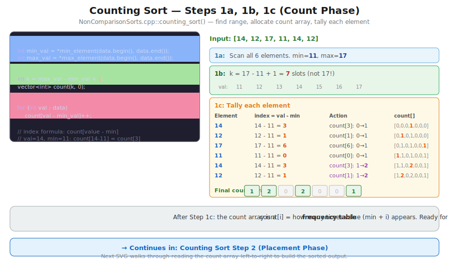
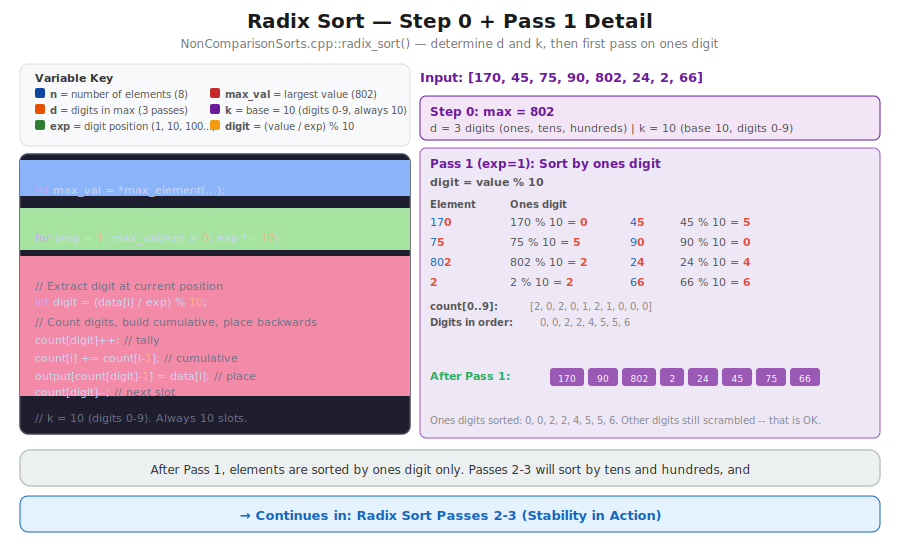

# CT14 -- Implementation Diagrams

Code-block diagrams referenced from `BucketSorts.cpp`.

---

## 1. Counting Sort -- Count Array and Placement
*`BucketSorts.cpp::counting_sort()` -- two passes: tally occurrences, then place directly*

---

## 2. Bucket Sort -- Distribution and Concatenation
*`BucketSorts.cpp::bucket_sort()` -- distribute into range-based buckets, sort each, concatenate*

---

## 3. Radix Sort -- One Digit Pass
*`BucketSorts.cpp::radix_sort()` -- extract digit, stable counting sort on that digit, repeat*

